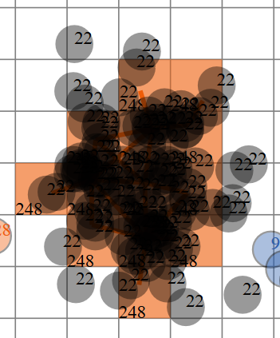
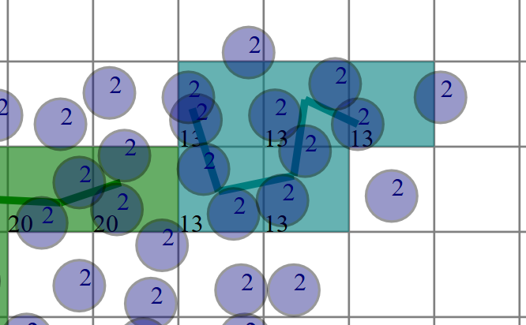

## Directory Structure ##

    data
       +-<dataset>
          +-devices
          +-central
             +-devicesCells
             +-consolidate 
             +-results
             +-DBSCAN
          +-config
    script
    sumData
    getCluster

### data directory ###

This directory has data to be processed

#### <dataset\> ####

For organization, each dataset has its own directory named `<dataset>`

##### devices

In this directory resides datasets from devices (CSV files)

##### central

This directory is used to store all data in the central node. If it doesn't exist it will be created at run time

###### devicesCells

This directory receive cells sent by each device.

For testing purposes it could be have raw data.

###### consolidate

The script gather all csv cells data received on deviceCells directory and create a single file with all cells. 

It could have raw data if the devices sent raw data for testing purposes.

###### results

This directory stores the results of clusterization algorithms. 
- CSV Files
- SVG File if the clustering dataset has 2 dimensions.

###### DBSCAN

Files created by DBSCAN algorithm

##### config

Store CSV configuration files

## Running the experiment

All the scripts to run the experiment are stored on `script` directory.

The main script is `complete.py`, that run all phases of process.

Below the help screen:

    Options           Description
      -h              Show this help
      -d <dir>        The data files gathering by devices will be found on <dir>/devices directory
      -e <epsilon>    Value of epsilon: default = 10
      -m <cells>      Minimum Cells (default: 3)
      -f <force>      Minimum Force (default: 150)
      -r              Don't draw rectangles
      -g              Don't draw edges
      -p              Draw points
      -b              Draw numbers
      -x              Configuration file: default config.csv on the <dir> directory

First of all you need to create a new directory to store dataset in a CSV format.

The CSV files must be stored in the `devices` directory below `<dataset>` directory you've just created.

The script runs `sumData` for each CSV file simulating the process that runs at each device.

### Configuration file

You'll need a configuration file that by default will be found at `<dataset>/config` directory with name `config-<dataset>.csv`

This CSV file must be 4 lines:

1. Header: the names of variables. 
	- Example: `X,Y,Id,Classification`
2. Variable Identification. 
	- (**C**)lustered: variables to be clustered
	- (**N**)ot clustered
	- C(**L**)assification: The Ground Truth label (if exists) to test the clustering algorithm.
	- Example: `C,C,N,L`
3. Max Values. Values to be used on linear normalization. This line must contain the max value of each column. 
	- Example: `30,30,0,0` 
4. Min Values. Values to be used on linear normalization. This line must contain the min value of each column. 
	- Example: `2.9,3.7,0,0`

**Note:** All lines must have the same number of columns.

### sumData 

The program sumData is stored on `sumData/bin` directory and summarize data stored in `<dataset>/devices/*.csv` and create a new CSV file with cells created by summarization. 

- Input
	- `<dataset>/devices/*.csv`
- Outputs (`complete.py` script)
	- `<dataset>/central/devicesCells/cell-<dataset>-<seq>.csv`. Where `<seq>` is a sequential number.
	- `<dataset>/central/devicesCells/point-<dataset>-<seq>.csv`. **Note**: this file is generated if use `-p` option
- Parameter
    - `-e` Epsilon parameter. The default value for Epsilon is 10. 

### Consolidation

The script gather all output files created by `sumData` and create one single file.

- Inputs
	- `<dataset>/central/devicesCells/cell-<dataset>-<seq>.csv`. Where `<seq>` is a sequential number.
	- `<dataset>/central/devicesCells/point-<dataset>-<seq>.csv` if used `-p` option.
- Outputs
	- `<dataset>/central/consolidate/cells-<dataset>.csv`
	- `<dataset>/central/consolidate/cells-<dataset>.csv` if used `-p` option.

### Clustering

With the cells gathered consolidated in one single file, the clustering algorithm take place.

It´s important to notice that the outputs generated by `complete.py` script create different file names for different parameters. It´s useful to remember the parameters used when compare results.

The script create a prefix for output files that identify the Epsilon and the Force used to run the process.

The prefix has the format: `ennnfd.dddd` where `nnn` is the value of Epsilon and `d.dddd` is the value of force. Example: if Epsilon = 35 and Force = 0.0777 the prefix will be `e035f0.077`. 

- Inputs
	- `<dataset>/central/consolidate/cells-<dataset>.csv`
	- `<dataset>/central/consolidate/cells-<dataset>.csv` if used `-p` option.
- Outputs (`complete.py` script)
	- `<dataset>/central/results/<prefix>-cells-<dataset>.csv`.
	- `<dataset>/central/results/<prefix>-points-<dataset>.csv` if used `-p` option.
	- `<dataset>/central/results/<prefix>-points-<dataset>.svg`. If dimension = 2 it´s possible generate a plotting file (SVG), that could be opened in any browser.
- Clustering Parameters 
    - `-e` Epsilon parameter. The default value for Epsilon is 10. 
    - `-f` Force parameter. If the force between cells is greater or equal then parameter the cells become together.
    - `-m` Minimum Cells. If a cluster is formed by less than parameter, the cluster is discarded.
- Plotting Parameters: used to configure SVG output:
	- `-r` Don´t draw cells (rectangles) 
	- `-g` Don´t draw edges that link the cells creating the clusters
	- `-p` Draw points. Used to compare raw data with clustering results.
	- `-b` Draw Numbers. Draw the labels of clusters inside the cells and label of ground-truth (classification column on raw data) inside points.

#### Output formats

The output files are in the CSV format:

##### Cells

<table>
  <tr>
    <th>Field</th>
    <th>Description</th>
  </tr>
  <tr>
    <td>cell-id</td>
    <td>Sequential number </td>
  </tr>
  <tr>
    <td>number-points</td>
    <td>Same as cell-id </td>
  </tr>
  <tr>
    <td>CM-0</td>
    <td rowspan=4>Coordinates of center of mass </td>
  </tr>
  <tr>
    <td>CM-1</td>
  </tr>
  <tr>
    <td>...</td>
  </tr>
  <tr>
    <td>CM-n</td>
  </tr>
  <tr>
    <td>qty-cells-cluster</td>
    <td>Quantity of cells of the cluster  </td>
  </tr>
  <tr>
    <td>gGluster-label</td>
    <td>Label of Cluster defined by gCluster </td>
  </tr>
  <tr>
    <td>ground-truth-cell-label  </td>
    <td>Label of Ground Truth cluster (Class Column) The ground truth of cell is determined by the class of center of mass' closest point
</td>
  </tr>
</table>

##### Points
<table>
  <tr>
    <th>Field</th>
    <th>Description</th>
  </tr>
  <tr>
    <td>Coord-0</td>
    <td rowspan="4">Coordinates of point </td>
  </tr>
  <tr>
    <td>Coord-1</td>
  </tr>
  <tr>
    <td>...</td>
  </tr>
  <tr>
    <td>Coord-n</td>
  </tr>
  <tr>
    <td>gGluster-label</td>
    <td>Label of Cluster defined by gCluster </td>
  </tr>
  <tr>
    <td>ground-truth-label </td>
    <td>Label of Ground Truth (Class. Column) </td>
  </tr>
</table>
 
## DBSCAN

The script `DBSCAN.py` runs the DBSCAN clustering algorithm to compare results.

It´s possible run DBSCAN over the points (raw data) or over the center of mass of cells generated by `sumData` program.

The goal is compare gCluster Algorithm with DBSCAN in two situations:
1. Run DBSCAN over the all data to compare centralized data and distributed data approaches.
2. Run DBSCAN over cell´s center of masses to verify if a conventional and mature algorithm has good performance over summarized data.

        Options         Description
        -h              Show this help
        -d <dir>        Directory of files
        -pr <pre>       Prefix of files (e<epsilon>f<force (with 4 decimals)> - Ex. e014f0.1500)
        -t <opt>        <opt> = c or p (for cells or points respectively)
        -e <value>      Epsilon value
        -m <value>      Min points value
        -l              Print legend

- Options
	- `-d` is the `<dataset>` directory
	- `-t` type of data: c for cells (center of mass of cells) or p for points (raw data).
	- `-pr` Prefix of files. Is the best way to ensure you are comparing correctly. The script uses this prefix to find out the input file
- DBSCAN parameters
	- `-e` Epsilon value. It´s important to notice that due the normalization the distance between minimum and maximum values for all dimensions is one. So this is a good reference to choose a good value of Epsilon.
- Inputs
	- `<dataset>/central/results/<prefix>-cells-<dataset>.csv` for cells (option `-t c`)
	- `<dataset>/central/results/<prefix>-points-<dataset>.csv` for points (option `-t p`) 
- Outputs
	- `<dataset>/central/DBSCAN/<prefix>-cells-DBSCAN-<dataset>.csv` for cells (option `-t c`)
	- `<dataset>/central/DBSCAN/<prefix>-points-DBSCAN-<dataset>.csv` for points (option `-t p`)

### Output formats

<table>
  <tr>
    <th>Field</th>
    <th>Description</th>
  </tr>
  <tr>
    <td>CM-0</td>
    <td rowspan=4>Coordinates of point or cell </td>
  </tr>
  <tr>
    <td>CM-1</td>
  </tr>
  <tr>
    <td>...</td>
  </tr>
  <tr>
    <td>CM-n</td>
  </tr>
  <tr>
    <td>gGluster-label</td>
    <td>Label of Cluster defined by DBSCAN </td>
  </tr>
  <tr>
    <td>ground-truth-label </td>
    <td>Label of Ground Truth cluster (Class Column) </td>
  </tr>
</table>

## Validation

The script `validation.py` runs the Fowlkes and Mallows index to compare a result of an algorithm with their ground-truth.

Each point has the ground-truth and the label find out by algorithm to be evaluated.

So it's created a set of 2-combinations from a set of n points and for each pair define:

- ss (same/same) - the two points belong in the same cluster on both gCluster and Ground Truth
- sd (same/different) - the two points belong in the same cluster on gCluster and different clusters on Ground Truth"
- ds (different/same) - the two points belong in different clusters on gCluster and in the same cluster on Ground Truth"
- dd (different/different) - the points belong in different clusters on both partitions

To calculate the Fowlker and Mallows index:

m1 = ss + sd (number of pairs ss plus number of pairs sd)
m2 = ds + dd (number of pairs ds plus number of pairs dd)

FM = ss / sqrt(m1.m2)

	Options      Description
     -h          Show this help
     -d <dir>    Directory of files
     -m <file>   File with map of indexes
     -t <opt>    <opt> = c or p (for cells or points respectively)
     -pr <pre>   Prefix of files
                   if gGluster pr = (e<epsilon (3 digits)>f<force (with decimals)> - Ex. e014f0.1500)
                   if DBSCAN pr = (e<epsilon (4 decimals)>m<minPts (with 3 digits)> - Ex. e0.1100m003)
     -b          Use this if you'll validate DBSCAN
    
- Options
	- `-d` is the `<dataset>` directory
	- `-m <file>` Map file ([see below](#map-file))
	- `-t <opt>` type of file (c)ell or (p)oint
	- `-pr <pre>` prefix of file. The same prefix of previous phases. This format is different between gCluster or DBSCAN. See help screen above.
	- `-b` indicate DBSCAN
- Inputs
	-  If `-t c` ([type = cells](#type--cells), algo = gCluster): `<dataset>/central/results/<prefix>-cells-result-<dataset>.csv` 
	-  If `-t p` ([type = points](#type--points), algo = gCluster): `<dataset>/central/results/<prefix>-points-result-<dataset>.csv` 
	-  If `-t c -b` ([type = cells](#type--cells-1), algo = DBSCAN): `<dataset>/central/results/<prefix>-cells-DBSCAN-<dataset>.csv` 
 	-  If `-t p -b` ([type = points](#type--points-1), algo = DBSCAN): `<dataset>/central/results/<prefix>-points-DBSCAN-<dataset>.csv` 
- Outputs
	- Show at screen:
		- values of ss, sd, ds, and dd 
		- value of FM Index

### Difference between use type = cells `-t c` and type = points `-t p`

#### Running over gCluster algorithm

##### type = cells

In this case the script will load the cells output of gGluster algorithm (file `<dataset>/central/results/<prefix>-cells-result-<dataset>.csv`). See the file format [here](#cells)

It will compare the labels of clusters generated by gCluster and labels from Ground Truth.

To find out the Ground Truth label of the cell, for each cell we chose the closest point to the center of mass.

In the figure 1, the ground truth label of the cell is 22.

 
<em>Figure 1: Cell label = 248, Ground Truth Label = 22</em>

In the Figure 2, all the points from raw data have the same label, but gCluster didn't join the two graphs (green and blue), probably due the Force parameter choose.

But in the validation, the cells from clusters 20 and 13 will have the same ground truth.

 
<em>Figure 2: Two different clusters find out by gClusters with the same ground truth</em>

##### type = Points 

In this case the script will load the points generated by gGluster algorithm (file `<dataset>/central/results/<prefix>-points-result-<dataset>.csv`).  See the file format [here](#points).

When use type = points (`-t p`), the script simulates all the points in the central node. To compare the same clustering algorithm running over the summarized data and raw data.

The idea is subtly different from the type = cell. To verify the cluster the algorithm found out to the point it just set the cluster label where the point belongs.

Examples:

- Figure 1: The points with Ground Truth label 22 will be set as label 43 for points that is inside cells with label 43, and -1 for points located on cells that doesn't belong to any cluster.
- Figure 2: Using the same idea, points from Ground Truth Label 2 will receive gCluster Labels 20, 13, and -1 depends on cell they are inserted into.

#### Running over DBSCAN algorithm

##### type = cells

In this case the script will load the cells output of DBSCAN algorithm (file `<dataset>/central/results/<prefix>-cells-DBSCAN-<dataset>.csv`). See the file format [here](#output-formats)

It will compare the labels of clusters generated by DBSCAN and labels from Ground Truth.

To find out the Ground Truth label of the cell, for each center of mass, the algorithm find out the closest point with distance equal or less then minPts. If there is no point close enough the the center of mass will receive the label -1.

##### type = Points 

In this case the script will load the points generated by DBSCAN algorithm (file `<dataset>/central/results/<prefix>-points-DBSCAN-<dataset>.csv`).  See the file format [here](#output-formats).

When use type = points, the script simulates all the points in the central node. To compare the same clustering algorithm running over the summarized data and raw data.

#### Map File

As you can see on Figures 1 to 3, the labels are defined automatically by algorithms. So, to validation works, the labels must match, because it uses the labels to determine if two points belongs or not to the same cluster.

So it's necessary create a Map File to create a relation between the label created by algorithms and the label provided by the Ground Truth file.

As the label could change depends on parameters of algorithms, it's necessary create a map file for each parameter. So, the file will use the prefix to identify the parameters used by algos.

##### Map File format

The map file is a CSV format and the following name is expected by `validation.py` script:

- `<dataset>/<prefix>-map-<dataset>.csv` for gCluster tests
- `<dataset>/<prefix>-DBSCAN-<dataset>.csv` for DBSCAN tests

