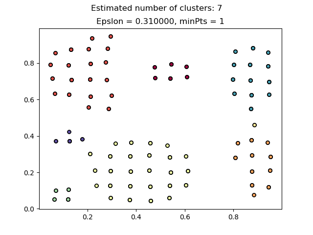
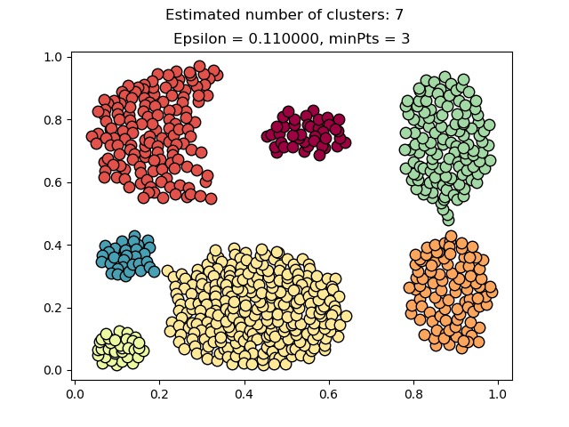

# Results

Experiments running gGluster and DBSCAN over several datasets provided in this [site](http://cs.uef.fi/sipu/datasets/), with most of them with Ground Truth.

The methodology of experiment:

1. Go to `script` directory
2. Run `complete.py` script testing the parameters. It summarize data and run gGluster 
2. Run `DBSCAN.py` script
3. Run `validation.py` script to test:
	- gCluster running over cells
	- DBSCAN running over cells
	- gGluster running over points
	- DBSCAN running over points

## Datasets
- [Agregation](#agregation)

### Agregation

- Number of clusters: 7
- Number of Points: 788
- Row Data: CSV File: [Agregation.csv](../../data/Agregation/devices/Aggregation.csv)
	- Size: 10,435 bytes
- Configuration File: [config-Agregation.csv](../../data/Agregation/config/config-Agregation.csv)
	- Size: 31 bytes

#### gCluster

##### Parameters

- Epsilon: 12
- Minimum Force: 0.21

##### Summarization and Clustering
- command line: `complete.py -d ../data/Agregation -e 12 -f 0.21 -p`

<table>
  <tr>
    <th colspan="2">Data Reduction </th>
  </tr>
  <tr>
    <td colspan="2"><b>raw data </td>
  </tr>
  <tr>
    <td>File Name </td>
    <td>Size (bytes) </td>
  </tr>
  <tr>
    <td>Agregation.csv</td>
    <td>10,435 </td>
  </tr>
  <tr>
    <td colspan="2"><b>summarized data </td>
  </tr>
  <tr>
    <td>File Name </td>
    <td>Size (bytes) </td>
  </tr>
  <tr>
    <td>config-Agregation.csv</td>
    <td>31</td>
  </tr>
  <tr>
    <td>cell-Agregation-01.csv</td>
    <td>3,228</td>
  </tr>
  <tr>
    <td><b>TOTAL </td>
    <td><b>3,259</td>
  </tr>
  <tr>
    <td></td>
    <td></td>
  </tr>
  <tr>
    <td><b>Reduction (%) </td>
    <td><b>68.77%</td>
  </tr>
</table>

#### DBSCAN

##### cells

###### Parameters

- Epsilon: 0.3100
- Minimum Points: 1

###### Clusterization
- command line: `DBSCAN.py -d ..\data\Agregation -pr e012f0.2100 -t c -e 0.3100 -m 1`

##### points

###### Parameters

- Epsilon: 0.1100
- Minimum Points: 3

###### Clusterization
- command line: `DBSCAN.py -d ..\data\Agregation -pr e012f0.2100 -t c -e 0.1100 -m 3`

#### Validation - gCluster

###### cells

- command line `validation.py -d ../data/Agregation -t c -pr e012f0.2100`
- map file: [e012f0.2100-cells-map-Agregation.csv](../../data/Agregation/config/e012f0.2100-cells-map-Agregation.csv)
- **Result --> FM: 0.920413**

###### points

- command line `validation.py -d ../data/Agregation -t p -pr e012f0.2100`
- map file: [e012f0.2100-points-map-Agregation.csv](../../data/Agregation/config/e012f0.2100-points-map-Agregation.csv)
- **Result --> FM: 0.912781**

#### Validation - DBSCAN

##### cells

- command line `validation.py -d ../data/Agregation -t c -pr  e0.3100m001 -b`
- map file: [e0.3100m001-cells-map-DBSCAN-Agregation.csv](../../data/Agregation/config/e0.3100m001-cells-map-DBSCAN-Agregation.csv)
- **Result -->  FM: 0.990363**

##### points

- command line `validation.py -d ../data/Agregation -t c -pr  e0.3100m001 -b`
- map file: [e0.1100m003-points-map-DBSCAN-Agregation.csv](../../data/Agregation/config/e0.1100m003-points-map-DBSCAN-Agregation.csv)
- **Result --> FM: 0.989107**

#### Agregation - Summary

<table>
  <tr>
    <th>FM</th>
    <th>gCluster </th>
    <th>DBSCAN</th>
  </tr>
  <tr>
    <td><b>cells </td>
    <td>0.920413</td>
    <td>0.990363</td>
  </tr>
  <tr>
    <td><b>points</td>
    <td>0.912781</td>
    <td>0.989107</td>
  </tr>
</table>