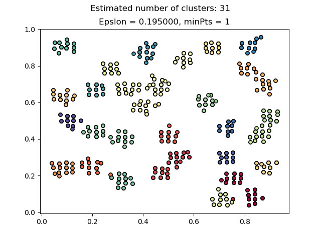
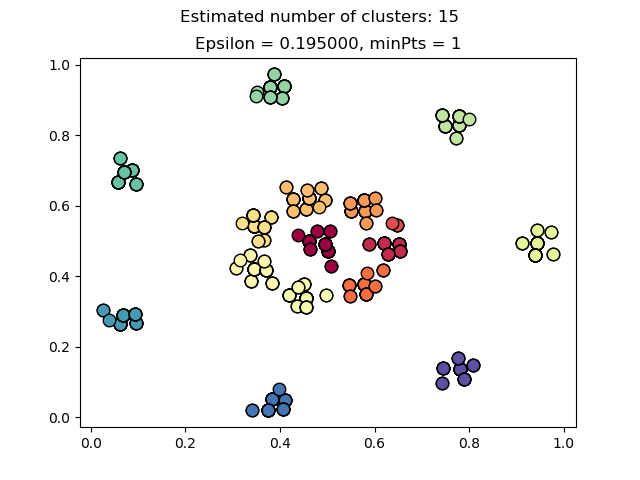
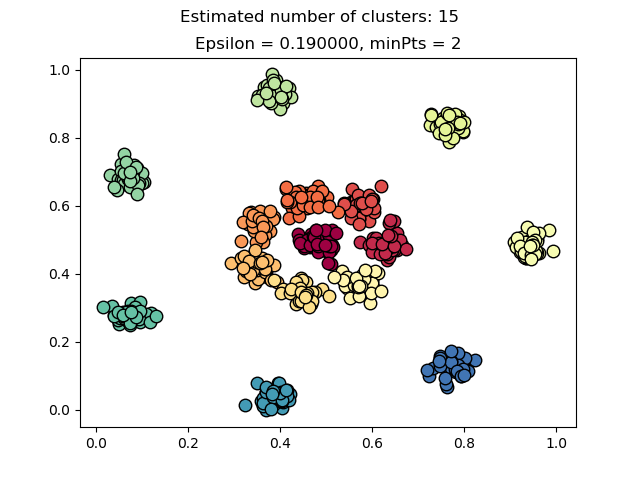
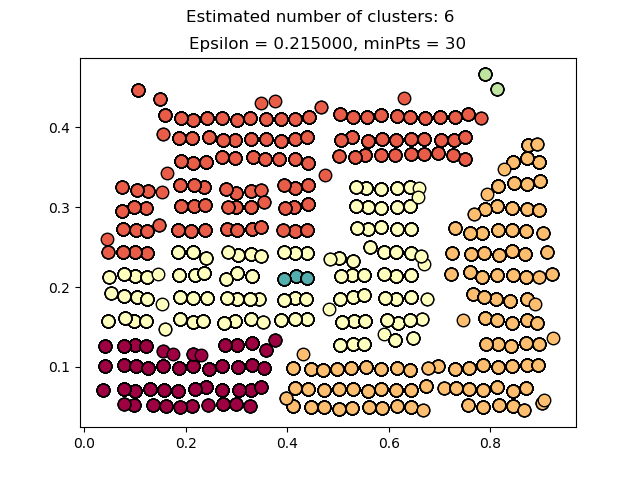
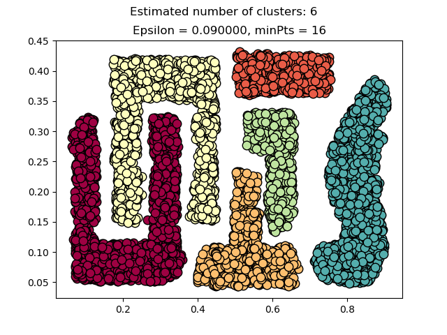

# Results

Experiments running gGluster and DBSCAN over several datasets provided in this [site](http://cs.uef.fi/sipu/datasets/), with most of them with Ground Truth.

The methodology of experiment:

1. Go to `script` directory
2. Run `complete.py` script testing the parameters. It summarize data and run gGluster 
2. Run `DBSCAN.py` script
3. Run `validation.py` script to test:
	- gCluster running over cells
	- DBSCAN running over cells
	- gGluster running over points
	- DBSCAN running over points

## Datasets

- With Ground Truth
	- [Agregation](#agregation)
	- [D31](#d31)
	- [R15](#r15)
- Without Ground Truth
	- [Chameleon](#chameleon)
	- [Taxi of Chicago](#taxi-of-chicago)

### Agregation

- Number of clusters: 7
- Number of Points: 788
- Configuration File: [config-Agregation.csv](../../data/Agregation/config/config-Agregation.csv)

#### gCluster

##### Parameters

- Epsilon: 12
- Minimum Force: 0.21

##### Summarization and Clustering
- command line: `complete.py -d ../data/Agregation -e 20 -f 0.1 -p`

<table>
  <tr>
    <th colspan="2">Data Reduction </th>
  </tr>
  <tr>
    <td colspan="2"><b>raw data </td>
  </tr>
  <tr>
    <td>File Name </td>
    <td>Size (bytes) </td>
  </tr>
  <tr>
    <td>Agregation.csv</td>
    <td>10,435 </td>
  </tr>
  <tr>
    <td colspan="2"><b>summarized data </td>
  </tr>
  <tr>
    <td>File Name </td>
    <td>Size (bytes) </td>
  </tr>
  <tr>
    <td>config-Agregation.csv</td>
    <td>31</td>
  </tr>
  <tr>
    <td>cell-Agregation-01.csv</td>
    <td>3,228</td>
  </tr>
  <tr>
    <td><b>TOTAL </td>
    <td><b>3,259</td>
  </tr>
  <tr>
    <td></td>
    <td></td>
  </tr>
  <tr>
    <td><b>Reduction (%) </td>
    <td><b>68.77%</td>
  </tr>
</table>

#### DBSCAN

##### cells

###### Parameters

- Epsilon: 0.3100
- Minimum Points: 1

###### Clusterization
- command line: `DBSCAN.py -d ..\data\Agregation -pr e020f0.1000 -t c -e 0.3100 -m 1`

##### points

###### Parameters

- Epsilon: 0.1100
- Minimum Points: 3

###### Clusterization
- command line: `DBSCAN.py -d ..\data\Agregation -pr e020f0.1000 -t p -e 0.1100 -m 3`

#### Validation - gCluster

###### cells

- command line `validation.py -d ../data/Agregation -t c -pr e020f0.1000`
- map file: [e020f0.1000-cells-map-Agregation.csv](../../data/Agregation/config/e020f0.1000-cells-map-Agregation.csv)
- **Result --> FM: 0.996649**

###### points

- command line `validation.py -d ../data/Agregation -t p -pr e020f0.1000`
- map file: [e020f0.1000-points-map-Agregation.csv](../../data/Agregation/config/e020f0.1000-points-map-Agregation.csv)
- **Result --> FM: 0.991132**

#### Validation - DBSCAN

##### cells

- command line `validation.py -d ../data/Agregation -t c -pr  e0.3100m001 -b`
- map file: [e0.3100m001-cells-map-DBSCAN-Agregation.csv](../../data/Agregation/config/e0.3100m001-cells-map-DBSCAN-Agregation.csv)
- **Result -->  FM: 0.999013**

##### points

- command line `validation.py -d ../data/Agregation -t c -pr  e0.3100m001 -b`
- map file: [e0.1100m003-points-map-DBSCAN-Agregation.csv](../../data/Agregation/config/e0.1100m003-points-map-DBSCAN-Agregation.csv)
- **Result --> FM: 0.996307**

#### Agregation - Summary

<table>
  <tr>
    <th>FM</th>
    <th>gCluster </th>
    <th>DBSCAN</th>
  </tr>
  <tr>
    <td><b>cells </td>
    <td>0.996649</td>
    <td>0.999013</td>
  </tr>
  <tr>
    <td><b>points</td>
    <td>0.991132</td>
    <td>0.996307</td>
  </tr>
</table>

### D31

- Number of clusters: 31
- Number of Points: 3100
- Configuration File: [config-D31.csv](../../data/D31/config/config-D31.csv)

#### gCluster

##### Parameters

- Epsilon: 35
- Minimum Force: 0.0777

##### Summarization and Clustering
- command line: `complete.py -d ../data/D31 -e 35 -f 0.0777 -p -x`

<table>
  <tr>
    <th colspan="2">Data Reduction </th>
  </tr>
  <tr>
    <td colspan="2"><b>raw data </td>
  </tr>
  <tr>
    <td>File Name </td>
    <td>Size (bytes) </td>
  </tr>
  <tr>
    <td>D31.csv</td>
    <td>118,204 </td>
  </tr>
  <tr>
    <td colspan="2"><b>summarized data </td>
  </tr>
  <tr>
    <td>File Name </td>
    <td>Size (bytes) </td>
  </tr>
  <tr>
    <td>config-D31.csv</td>
    <td>34</td>
  </tr>
  <tr>
    <td>cell-D31-01.csv</td>
    <td>21,055</td>
  </tr>
  <tr>
    <td><b>TOTAL </td>
    <td><b>21,089</td>
  </tr>
  <tr>
    <td></td>
    <td></td>
  </tr>
  <tr>
    <td><b>Reduction (%) </td>
    <td><b>82.16%</td>
  </tr>
</table>

#### DBSCAN 

##### cells

###### Parameters

- Epsilon: 0.195
- Minimum Points: 2

###### Clusterization
- command line: ` DBSCAN.py -d ..\data\D31 -t c -e 0.195 -m 2`

##### points

###### Parameters

- Epsilon: 0.0800
- Minimum Points: 3

###### Clusterization
- command line: `DBSCAN.py -d ..\data\D31 -pr e035f0.0777 -t p -e 0.08 -m 3`

#### Validation - gCluster

###### cells

- command line `validation.py -d ../data/D31 -t c -pr e035f0.0777`
- map file: [e035f0.0777-cells-result-D31.csv](../../data/D31/config/e035f0.0777-cells-result-D31.csv)
- **Result --> FM: 0.998700**

###### points

- command line `validation.py -d ../data/D31 -t p -pr e035f0.0777`
- map file: [e035f0.0777-points-map-D31.csv](../../data/D31/config/e035f0.0777-points-map-D31.csv)
- **Result --> FM: 0.978455**

#### Validation - DBSCAN

##### cells

- command line `validation.py -d ../data/D31 -t c -pr e0.1950m001 -b`
- map file: [e0.1950m001-cells-map-DBSCAN-D31.csv](../../data/D31/config/e0.1950m001-cells-map-DBSCAN-D31.csv)
- **Result -->  FM: 0.993803**

##### points

- command line `validation.py -d ../data/D31 -t p -pr e0.0800m003 -b`
- map file: [e0.0800m003-points-map-DBSCAN-D31.csv](../../data/D31/config/e0.0800m003-points-map-DBSCAN-D31.csv)
- **Result --> FM: 0.997939**

#### D31 - Summary

<table>
  <tr>
    <th>FM</th>
    <th>gCluster </th>
    <th>DBSCAN</th>
  </tr>
  <tr>
    <td><b>cells </td>
    <td>0.998700</td>
    <td>0.993803</td>
  </tr>
  <tr>
    <td><b>points</td>
    <td>0.978455</td>
    <td>0.997939</td>
  </tr>
</table>

### R15

- Number of clusters: 15
- Number of Points: 600
- Configuration File: [config-r15.csv](../../data/r15/config/config-r15.csv)

#### gCluster

##### Parameters

- Epsilon: 25
- Minimum Force: 0.0438
- Minimum Cells: 2

##### Summarization and Clustering
- command line: `complete.py -d ../data/r15 -e 25 -f 0.0438 -m 2 -p`

<table>
  <tr>
    <th colspan="2">Data Reduction </th>
  </tr>
  <tr>
    <td colspan="2"><b>raw data </td>
  </tr>
  <tr>
    <td>File Name </td>
    <td>Size (bytes) </td>
  </tr>
  <tr>
    <td>r15.csv</td>
    <td>9,555 </td>
  </tr>
  <tr>
    <td colspan="2"><b>summarized data </td>
  </tr>
  <tr>
    <td>File Name </td>
    <td>Size (bytes) </td>
  </tr>
  <tr>
    <td>config-r15.csv</td>
    <td>35</td>
  </tr>
  <tr>
    <td>cell-r15-01.csv</td>
    <td>3,962</td>
  </tr>
  <tr>
    <td><b>TOTAL </td>
    <td><b>3,997</td>
  </tr>
  <tr>
    <td></td>
    <td></td>
  </tr>
  <tr>
    <td><b>Reduction (%) </td>
    <td><b>58.17%</td>
  </tr>
</table>

#### DBSCAN 

##### cells

###### Parameters

- Epsilon: 0.195
- Minimum Points: 1

###### Clusterization
- command line: `DBSCAN.py -d ..\data\r15 -pr e025f0.0438 -t c -e 0.195 -m 1`

##### points

###### Parameters

- Epsilon: 0.19
- Minimum Points: 2

###### Clusterization
- command line: `DBSCAN.py -d ..\data\R15 -pr e025f0.0438 -t p -e 0.19 x -m 2`

#### Validation - gCluster

###### cells

- command line `validation.py -d ..\data\R15 -t c -pr e025f0.0438`
- map file: [e025f0.0438-cells-map-R15.csv](../../data/R15/config/e025f0.0438-cells-map-R15.csv)
- **Result --> FM: 0.997665**

###### points

- command line `validation.py -d ..\data\R15 -t p -pr e025f0.0438`
- map file: [xx.xx-points-map-xx.csv](../../data/xx/config/xx.xx-points-map-xx.csv)
- **Result --> FM: 0.996113**

#### Validation - DBSCAN

##### cells

- command line `validation.py -d ..\data\R15 -t c -pr e0.1950m001 -b`
- map file: [xx-cells-map-DBSCAN-xx.csv](../../data/xx/config/e0.xx-cells-map-DBSCAN-xx.csv)
- **Result -->  FM: 0.994450**

##### points

- command line `validation.py -d ..\data\R15 -t p -pr e0.1900m002 -b`
- map file: [xx.xx-points-map-DBSCAN-xx.csv](../../data/xx/config/e0.xx-points-map-DBSCAN-D31.csv)
- **Result --> FM: 0.999891

#### R15 - Summary

<table>
  <tr>
    <th>FM</th>
    <th>gCluster </th>
    <th>DBSCAN</th>
  </tr>
  <tr>
    <td><b>cells </td>
    <td>0.997665</td>
    <td>0.994450</td>
  </tr>
  <tr>
    <td><b>points</td>
    <td>0.996113</td>
    <td>0.999891</td>
  </tr>
</table>

### Chameleon

- Number of clusters: 6
- Number of Points: 8,000
- Configuration File: [config-chameleon.csv](../../data/chameleon/config/config-chameleon.csv)

#### gCluster

##### Parameters

- Epsilon: 35
- Minimum Force: 0.18
- Miminum Cells: 3

##### Summarization and Clustering
- command line: `complete.py -d ..\data\chameleon -e 50 -f 0.08 -p`

<table>
  <tr>
    <th colspan="2">Data Reduction </th>
  </tr>
  <tr>
    <td colspan="2"><b>raw data </td>
  </tr>
  <tr>
    <td>File Name </td>
    <td>Size (bytes) </td>
  </tr>
  <tr>
    <td>chameleon.csv</td>
    <td>168,139 </td>
  </tr>
  <tr>
    <td colspan="2"><b>summarized data </td>
  </tr>
  <tr>
    <td>File Name </td>
    <td>Size (bytes) </td>
  </tr>
  <tr>
    <td>config-chameleon.csv</td>
    <td>24</td>
  </tr>
  <tr>
    <td>cell-chameleon-01.csv</td>
    <td>18,492</td>
  </tr>
  <tr>
    <td><b>TOTAL </td>
    <td><b>18,516</td>
  </tr>
  <tr>
    <td></td>
    <td></td>
  </tr>
  <tr>
    <td><b>Reduction (%) </td>
    <td><b>88,99%</td>
  </tr>
</table>

#### DBSCAN 

##### cells

###### Parameters

- Epsilon: 0.215
- Minimum Points: 30

###### Clusterization
- command line: `DBSCAN.py -d ..\data\chameleon -t c -e .215 -m 30`

##### points

###### Parameters

- Epsilon: 0.09
- Minimum Points: 16

###### Clusterization
- command line: ` DBSCAN.py -d ..\data\chameleon -t p -e .09 -m 16`

### Taxi of Chicago

- Number of Devices (distributed nodes): 6
- Number of Points: 
	- Taxi 1 (id=455b6b): 14,209 
	- Taxi 2 (id=4c8b67): 11,246
	- Taxi 3 (id=5f1b23): 13,688
	- Taxi 4 (id=7c51c6): 10,006
	- Taxi 5 (id=b50eb9): 14,097
	- Taxi 6 (id=d1b852): 12,688
	- TOTAL OF POINTS: 75,934
- Configuration File: [config-ChicagoTaxi.csv](../../data/ChicagoTaxi/config/config-xx.csv)

#### gCluster

##### Parameters

- Epsilon: 12
- Minimum Force: 0.1

##### Summarization and Clustering
- command line: `complete.py -d ..\data\ChicagoTaxi -e 12 -f 0.1 -m 2`

<table>
  <tr>
    <th colspan="2">Data Reduction </th>
  </tr>
  <tr>
    <td colspan="2"><b>raw data </td>
  </tr>
  <tr>
    <td>File Name </td>
    <td>Size (bytes) </td>
  </tr>
  <tr>
    <td>455b6b.csv</td>
    <td>874,912 </td>
  </tr>
  <tr>
    <td>4c8b67.csv</td>
    <td>691,815 </td>
  </tr>
  <tr>
    <td>5f1b23.csv</td>
    <td>844.861 </td>
  </tr>
  <tr>
    <td>7c51c6.csv</td>
    <td>618.005 </td>
  </tr>
  <tr>
    <td>b50eb9.csv</td>
    <td>869.513 </td>
  </tr>
  <tr>
    <td>d1b852.csv</td>
    <td>782.584
  </tr>
  <tr>
    <td><b>TOTAL </td>
    <td><b>4,681,690</td>
  </tr>
  <tr>
    <td colspan="2"><b>summarized data </td>
  </tr>
  <tr>
    <td>File Name </td>
    <td>Size (bytes) </td>
  </tr>
  <tr>
    <td>config-ChicagoTaxi.csv</td>
    <td>34</td>
  </tr>
		<tr>
		  <td> cell-ChicagoTaxi-01.csv </td>
		  <td> 592,235   </td>
		</tr>
		<tr>
		  <td> cell-ChicagoTaxi-02.csv </td>
		  <td> 280,904   </td>
		</tr>
		<tr>
		  <td> cell-ChicagoTaxi-03.csv </td>
		  <td> 612,363   </td>
		</tr>
		<tr>
		  <td> cell-ChicagoTaxi-04.csv </td>
		  <td> 505,784   </td>
		</tr>
		<tr>
		  <td> cell-ChicagoTaxi-05.csv </td>
		  <td> 697,810   </td>
		</tr>
		<tr>
		  <td> cell-ChicagoTaxi-06.csv </td>
		  <td> 595,033   </td>
		</tr>
		
  <tr>
    <td><b>TOTAL </td>
    <td><b>2,656,134</td>
  </tr>
  <tr>
    <td></td>
    <td></td>
  </tr>
  <tr>
    <td><b>Reduction (%) </td>
    <td><b>43.27%</td>
  </tr>
</table>

###### Result

- Clusters Found: 194
- Number of Cells: 33,116
- Number of Points  : 75,934
- Avg Points by Cell: 2.29297